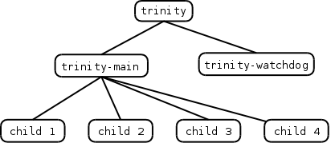

# Trinity

Linux内核开发人员早已意识到需要更好地测试内核。
这种测试可以采取多种形式，包括测试性能回归和测试构建和引导回归。
回归测试涉及检测新内核版本导致代码中的问题,或先前版本的内核中已经存在的功能的情况。
每个新的内核版本也增加了新功能。
Trinity旨在提高一类新的（现有）的测试功能：内核呈现到用户空间系统调用接口。

对新用户空间接口的测试不足是内核开发中长期存在的问题。从历史上看，在接口出现在一个稳定的内核之后的相当长时间内，在新接口中发现了重要的错误是很常见的，例如epoll_ctl（）， kill（）， signalfd（）和utimensat（）。
问题在于，通常只有一个人（功能开发人员）或至多少数对界面有浓厚兴趣的人测试了一个新接口。
开发人员编写自己的测试时出现的一个常见问题是对测试的导向偏见，这些测试确认预期的输入会产生预期的结果。
当然，当软件以意想不到的方式用于测试少量使用的代码路径时，通常会发现错误。

模糊测试是一种旨在扭转这种测试偏见的技术。
总体思路是以随机（或半随机）值的形式为正在测试的软件提供意想不到的输入。
模糊测试有两个明显的好处。首先，使用意外输入意味着很少使用代码路径进行测试。其次，随机输入和测试本身的生成可以完全自动化，因此可以快速执行大量测试。

## 智能模糊测试

Trinity通过整合经过测试的每个系统调用的特定知识来执行智能模糊测试。这个想法是减少运行“无用”测试的时间，从而深入到测试代码中，并增加测试可能导致意外错误的更有趣的案例的机会。因此，例如，Trinity不会将随机值传递给madvise（）的建议参数，而是传递该参数所期望的值之一。

同样，Trinity不会传递随机位模式来解决参数，而是限制位模式，以便在大部分时间内提供的地址是页面对齐的。
但是，一些接受地址参数的系统调用不需要内存对齐的地址。因此，当生成一个随机地址进行测试时，Trinity还会倾向于创建“有趣的”地址，例如，通过sizeof（char）或 sizeof（long）的值离开页面边界的地址。诸如此类的地址可能是内核代码中“错误”错误的候选对象。

另外，许多需要内存地址的系统调用都要求该地址指向实际映射的内存。如果给定地址没有映射，则这些系统调用失败（典型错误是ENOMEM或EFAULT）。当然，在现代64位体系结构的大地址空间中，大部分地址空间都是未映射的，所以即使模糊测试器总是生成页面对齐的地址，大多数生成的测试也会浪费在生成相同的地址空间上无趣的错误。因此，在向系统调用提供内存地址时，Trinity将优先考虑现有映射的地址。同样，为了触​​发意外错误，Trinity将传递“有趣”映射的地址，例如，包含全零或全1的页面地址，或内核映射的起始地址。

为了给它的测试带来智能，Trinity必须理解每个系统调用的参数。
这是通过定义注释每个系统调用的结构来完成的。[参见原文例子](https://lwn.net/Articles/536173/)

``` c
    struct syscall syscall_madvise = {
        .name = "madvise",
        .num_args = 3,
        .arg1name = "start",
        .arg1type = ARG_NON_NULL_ADDRESS,
        .arg2name = "len_in",
        .arg2type = ARG_LEN,
        .arg3name = "advice",
        .arg3type = ARG_OP,
        .arg3list = {
            .num = 12,
            .values = { MADV_NORMAL, MADV_RANDOM, MADV_SEQUENTIAL, MADV_WILLNEED,
                    MADV_DONTNEED, MADV_REMOVE, MADV_DONTFORK, MADV_DOFORK,
                    MADV_MERGEABLE, MADV_UNMERGEABLE, MADV_HUGEPAGE, MADV_NOHUGEPAGE },
        },
        ...
    }
```

此注释描述系统调用接受的三个参数中每一个的名称和类型。例如，第一个参数被注释为ARG_NON_NULL_ADDRESS，这意味着Trinity应该为这个参数提供一个智能选择的，半随机的非零地址。最后一个参数被注释为ARG_OP，这意味着Trinity应该随机选择相应列表中的一个值（上面的MADV_ *值）。

第二个madvise（）参数被标注为ARG_LEN，这意味着它是一个内存缓冲区的长度。同样，Trinity并不是将纯粹的随机值传递给这样的参数，而是试图生成更有可能触发错误的“有趣”数字，例如，最低有效位为0xfff的值可能会在参数中找到一个错误的错误某些系统调用的逻辑。

Trinity还了解一系列其他注释，包括 ARG_RANDOM_INT，ARG_ADDRESS（可以为零的地址），ARG_PID（进程ID），ARG_LIST（用于通过对从指定列表中随机选择的值进行逻辑或操作构成的位掩码），ARG_PATHNAME和ARG_IOV（一种传递给系统调用的 结构iovec，如 readv（））。在每种情况下，Trinity都会使用注释来生成更有可能触发意外错误的好于随机的测试值。另一个有趣的注释是ARG_FD这导致Trinity将一个打开的文件描述符传递给被测系统调用。为此，Trinity会打开各种文件描述符，包括管道，网络套接字和/ dev， / proc和/ sys等位置中的文件的描述符。打开的文件描述符被随机传递给需要描述符的系统调用。到现在为止，您可能会开始明白，您不想在拥有您的家庭相册的唯一副本的系统上运行Trinity。

除了注释之外，每个系统调用还可以有一个sanitise routine，对系统调用的参数进行进一步的微调。
sanitize例程可以被用于构建需要特殊值（例如，结构），或在那是相互依赖的参数正确地初始化值的参数。它也可以用来确保参数的值不会导致预期的错误。例如，[madvise（）系统调用的清理例程如下所示：]((https://lwn.net/Articles/536173/))

``` c
  static void sanitise_madvise（int childno）
    {
        shm-> a2 [childno] = rand（）％page_size;
    }
```

这可确保为madvise（）提供的第二个（长度）参数 不会大于页面大小，从而防止当较大长度 值导致madvise（）触及未映射内存区域时通常会导致的 ENOMEM错误。显然，这意味着测试将永远不会执行将madvise（）应用于大于一页的区域的情况 。通过有时允许长度值大于页面大小，可以改进这种特殊的清理程序。

## 运行

使用命令行调用Trinity，如下所示：

     $ ./trinity
没有参数，程序会重复测试随机选择的系统调用。也可以使用-c命令行选项的一个或多个实例来测试选定的系统调用。这在测试新的系统调用时特别有用。因此，例如，可以使用以下命令测试madvise（）系统调用：

     $ ./trinity -c madvise
为了执行它的工作，Trinity创建了许多进程，如下图所示：


1. 主进程执行各种初始化（例如，打开文件描述符和创建用于测试的存储器映射）
2. 启动执行系统调用的测试的子进程。（默认值：4）

共享内存区域（由最初的Trinity进程创建）用于记录各种全局信息，例如打开的文件描述符编号，执行的总系统调用次数以及成功和失败的系统调用次数。
共享内存区域还记录有关每个子进程的各种信息，包括PID，当前正在执行的系统调用的系统调用编号和参数以及之前执行的系统调用。

看门狗监视进程确保测试系统仍在正常工作。

- 检查孩子是否正在执行（他们可能在系统调用中被阻止），如果他们不在，则会将其杀死;
- 主进程检测到它的一个子进程已经终止（因为看门狗杀死它或者出于其他原因），它会启动一个新的子进程来替换它。
- 看门狗还监视共享存储器区域的完整性，如果某一子进程破坏了共享内存

每个子进程都写入一个单独的日志文件，记录它执行的系统调用以及这些系统调用的返回值。
在执行每个系统调用之前，文件会被同步，因此如果系统发生混乱，可以通过查看每个日志文件中最后记录的系统调用来确定内核panic的原因。
日志文件包含以下行，这些行显示子进程的PID，顺序测试编号以及系统调用参数和结果：

``` c
    [17913] [0] mmap(addr=0, len=4096, prot=4, flags=0x40031, fd=-1, off=0) = -1 (Invalid argument)
    [17913] [1] mmap(addr=0, len=4096, prot=1, flags=0x25821, fd=-1, off=0x80000000) = -541937664
    [17913] [2] madvise(start=0x7f59dff7b000, len_in=3505, advice=10) = 0
    ...
    [17913] [6] mmap(addr=0, len=4096, prot=12, flags=0x20031, fd=-1, off=0) = -1 (Permission denied)
    ...
    [17913] [21] mmap(addr=0, len=4096, prot=8, flags=0x5001, fd=181, off=0) = -1 (No such device)
```

让Trinity运行，直到触发内核恐慌，然后查看子日志和系统日志，以便发现恐慌的原因。Dave有时会让系统运行数小时或数天以发现此类故障。可以使用上述的-c命令行选项来执行新的系统调用 。另一种可能的用途是发现现有系统调用的意外（或未记录）失败模式：对日志文件的适当脚本可用于获取特定系统调用的各种失败摘要。

使用Trinity的另一种方式是使用-V（受害者文件）选项。该选项需要一个目录参数：程序将随机打开该目录中的文件，并将生成的文件描述符传递给系统调用。这对发现特定文件系统类型的故障模式很有用。例如，将NFS挂载点指定为目录参数将执行NFS。所述-V标志也可以被用于有限的测试用户空间程序。在他的linux.conf.au演示文稿中，Dave演示了如何使用以下命令：

$ ./trinity -V / bin -c execve

该命令的作用是在/bin中利用随机字符串作为输入，随机执行程序。
查看系统日志显示了大量的程序，当发生意外的参数时，它们会因分段错误而崩溃。

## 结果

Trinity在寻找错误方面相当成功。戴夫报告说，他自己在2012年发现了超过150个错误，其他人使用Trinity时也发现了更多错误。Trinity通常会很快发现新代码中的错误。它往往会重复地找到相同的错误，所以为了找到其他错误，可能需要首先修复已经发现的错误。

有趣的是，Trinity不仅在系统调用代码中发现了错误。在内核的许多其他部分都发现了错误，包括网络堆栈，虚拟内存代码和驱动程序。Trinity发现了许多错误路径内存泄漏和系统调用错误路径无法释放内核锁的情况。另外，它发现了一些测试覆盖率较差或者根本没有测试的内核代码。迄今为止Trinity迄今为止发现的最古老的虫子可追溯到1996年。

## 限制和未来的工作

### 需要更多的sanitise routines规约

尽管Trinity已经是一个非常有效的工具来发现错误，但还有很多工作可以让它变得更好。
一个正在进行的任务是添加对新系统调用和新系统调用标志的支持，因为它们被添加到内核中。目前只有约百分之十的系统调用具有sanitise routines的功能。也许很多其他系统调用可以用于sanitise routines.，以便测试可以深入到这些系统调用的代码中，而不会触发相同的常见错误和预期错误。
Trinity支持许多网络协议，但可以进一步改进支持，并且还可以添加其他支持的网络协议。

某些系统调用使用AVOID_SYSCALL标志进行注释，该标志告诉Trinity避免测试该系统调用。（--list 选项使Trinity显示它知道的系统调用的列表，并指出那些使用AVOID_SYSCALL注释的系统调用 。）在某些情况下，避免系统调用，因为它对测试不感兴趣例如，诸如fork（）这样的系统调用 没有fuzz参数，exit（）只会终止测试过程。一些其他系统调用会干扰Trinity本身的操作 - 例子包括close（），它会随机关闭子进程使用的测试文件描述符，而nanosleep（），这可能会让子进程长时间睡眠。

但是，还有其他系统调用，例如ptrace（）和 munmap（），目前标有AVOID_SYSCALL，但可能通过向Trinity添加更多智能来进行测试。例如，可以避免使用munmap（），因为它可以轻松地取消映射子映射的执行。但是，如果Trinity添加了一些记录代码，以记录它创建的测试映射的更好信息，那么（仅）这些映射可以在munmap（）的测试中提供，而不会干扰子进程所需的其他映射。

### 应用程序调用系统服务的模式

目前，Trinity随机调用系统调用。
但是真正的程序有系统调用的常用模式。例如，打开，阅读和关闭文件。
Dave希望为这些常见模式添加测试支持。

### ioctl驱动测试

Trinity当前提供较差覆盖的领域是多路复用ioctl（）系统调用，“人们已知的最糟糕的接口 ”。
问题在于，ioctl（）实际上是一群伪装成单个API的系统调用。第一个参数是引用设备或其他文件类型的文件描述符，第二个参数是依赖于第一个参数引用的文件或设备类型的请求类型，第三个参数的数据类型取决于请求类型。为了实现对ioctl（）的良好测试支持将需要注释每个请求类型以确保它与正确类型的文件描述符以及第三个参数的正确数据类型相关联。这里的工作量几乎是无限的，因为有数百种请求类型; 因此，首先，这项工作可能仅限于支持更有趣的请求类型的子集。

戴夫希望在三位一体中看到许多其他改进; 源代码压缩包含一个冗长的TODO 文件。在这些改进中，更好地支持系统调用处理代码中的“析构函数”，这样Trinity不会泄漏内存，并支持以root身份调用（某些）系统调用。更一般地说，Trinity找到进一步内核错误的能力实际上是无限的：它只需要为每个测试添加更多的智能。

