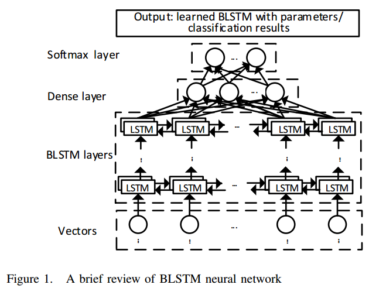
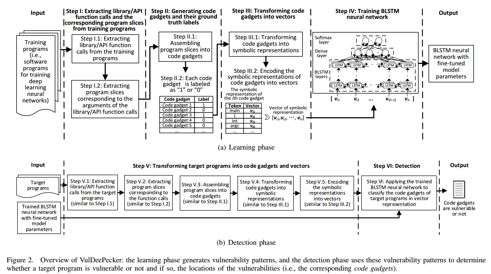
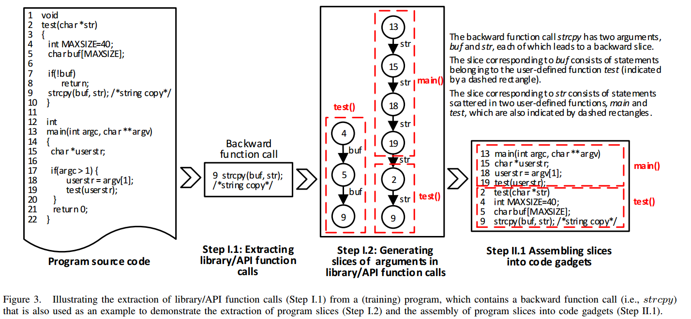
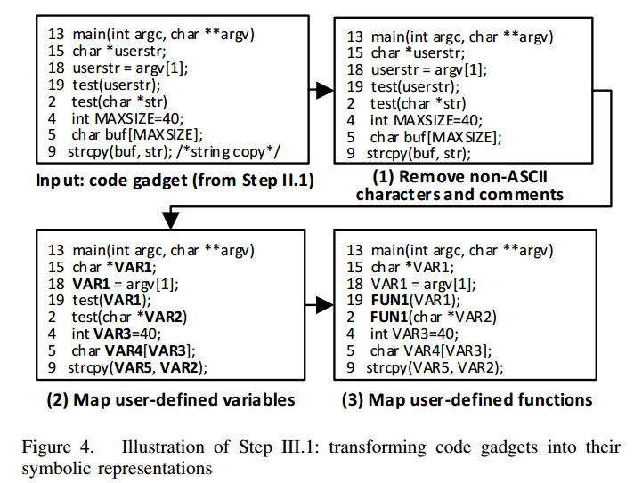

# VulDeePecker: A Deep Learning-Based System for Vulnerability Detection

## 摘要

自动化软件漏洞检测很重要。

问题：漏洞检测依赖专家定义特征，漏报率高。

目标：研究利用基于深度学习的漏洞检测方法，避免繁琐主观的人工定义特征。

挑战：深度学习应用场景与漏洞检测差别大

研究内容：

- 适用于深度学习的程序表征（应用code gadget提取特定行数的代码的语义相关特征）
- 设计实现了基于学习的漏洞检测系统vuldepecker
- 第一个用于深度学习方法的漏洞检测数据库

效果：

- 漏报减少
- 实际应用：3 software products (namely Xen, Seamonkey, and Libav) and detect 4 vulnerabilities

## 引言

动机：

- 许多网络攻击源自软件漏洞。漏洞数量逐年增长。-》需要自动化漏洞检测！
- 有很多工具和研究（商用、开源、学术研究）
- 两个缺陷：大量人工参与与高漏报率（漏报误报难平衡）。
- 漏洞检测系统需求：无需人工专家手动定义特征，不产生高假阴性率或假阳性率。
- 研究问题:给定目标程序的源代码，我们如何确定目标程序是否脆弱，如果有，漏洞在哪里?

贡献：

- 采用深度学习进行漏洞检测
    - 挑战：深度学习不是为此而生的，需要适配，明确针对什么代码粒度进行怎样的特征描述。
    - 方案： A code gadget is a number of (not necessarily consecutive) lines of code that are semantically related to each other, and can be vectorized as input to deep learning. （代码gadget是一组(不一定是连续的)代码行，它们在语义上是相互关联的，作为深度学习的输入向量。）
- VulDeePecker评估：
    - VulDeePecker可以同时处理多种类型的漏洞吗?
        - 目标程序可能包含多种类型的漏洞
        - 实验结果:可以。因为VulDeePecker利用漏洞模式(学习到深度神经网络)来检测漏洞。
    - 人类的专业知识能帮助提高效率吗?
        - 可以。
    - VulDeePecker与其他漏洞工具相比有多有效?
        - 实验结果表明，VulDeePecker比要求人类专家定义检测漏洞的规则其他静态分析工具，和先进的代码相似的漏洞检测系统(即:,VUDDY VulPecker)更有效。
- 提供了数据库

## GUIDING PRINCIPLES FOR DEEP LEARNING-BASED VULNERABILITY DETECTION

### 如何表征程序？
指导原则1:程序可以首先转换成一些中间表示，可以保留程序元素之间的语义关系(例如，数据依赖关系和控制依赖关系)。然后, 中间表示可以转换成一个向量表示，它是神经网络的实际输入
Guiding Principle 1: Programs can be first transformed into some intermediate representation that can preserve (some of) the semantic relationships between the programs’ elements (e.g., data dependency and control dependency). Then, the
intermediate representation can be transformed into a vector representation that is the actual input to neural networks

### 合适粒度怎么选？

检测程序是否有漏洞还不够，需要落实到漏洞的具体位置。因此检测粒度不能只是函数段或者程序段，否则很难确定漏洞具体位置。

原则2：粒度必须必程序或者函数单元更细

### 如何选神经网络？

原则3：因为一行代码是否包含一个漏洞可能取决于上下文，能够处理上下文的神经网络可能适合于漏洞检测。

适用于自然语言处理的可能也适用于代码。程序函数调用的参数常常受到前后程序的影响。

从RNN开始，适用序列数据，已经用于程序分析，但不包括漏洞检测目的。然而RNN受限于梯度消失问题，难以有效训练。作者希望用一个不受到梯度消失影响的网络。因此选择LSTM和GRU单元，又因为GRU在语言建模上没有优势，作者选择LSTM并且把与GRU的比较放在未来工作。此外，由于程序函数调用受到前后程序影响，单项LSTM不合适，因此选择双向LSTM（BLSTM）

## DESIGN OF VULDEEPECKER

设计目标：
我们的目标是设计一个漏洞检测系统，它可以自动判断一个给定的程序在源代码中是否脆弱，如果是，确定漏洞的位置。这应该在不让人类专家手动定义特征的情况下实现，并且不产生高的假阴性率(只要假阳性的比率是合理的)。

### 定义code gadget

代码gadget：一段（几行）在数据依赖和控制依赖上相关的代码

采用启发式的“关键点”。一个类型的漏洞可能有多种关键点。(缓冲错误漏洞可能对应于以下要点:库/ API函数调用,数组和指针)。一个关键点也可能对应在多种漏洞上。

精确的定义关键点的作者没有考虑。作者聚焦于采用特定函数调用的关键点，来说明基于深度学习的漏洞检测的有效性。这是由于函数调用导致的漏洞很多。其他的关键点类型也作为了未来工作。

函数调用的code gadgets能从程序控制流或者数据流分析中提取，控制流数据流生成有现成的算法和实用工具（Checkmarx）

### VulDeePecker概述

#### 训练阶段

1. 提取函数调用和程序切片
    1. 提取函数调用，聚焦于函数调用关键点相关的漏洞
    2. 基于1.1，对于函数调用中的每一个参数或变量提取切片。
2. 生成code gadgets和label
    1. 每个函数调用生成一个code gadget。
    2. label直接二分类，即有没有漏洞
3. code gadgets向量化
    1. code gadgets转化为特定符号表征，保留语义信息
    2. 编码，以适用于通用神经网络训练
4. 训练BLSTM
5. 目标程序提取code gadgets和向量化
    1. 提取目标程序函数调用；
    2. 根据函数调用提取程序切片；
    3. 合成code gadgets
    4. 符号表征
    5. 向量化
6. 检测二分类

### Step I: Extracting library/API function calls and program slices

特征生成在整个过程中很重要，因此细说一下。

1. 提取函数调用与程序切片
    
    1. 提取库/API函数调用:我们将库/API函数调用分为两类:forward library/API函数调用和向后库/API函数调用。
        - 前向library/API函数调用是直接从外部输入接收一个或多个输入的函数调用，例如命令行、程序、套接字或文件。前向调用中，受到输入参数影响的语句很重要，因为参数值误用很容易导致漏洞
        - 后向库/API函数调用是不接收任何外部输入的函数调用。对于后巷调用，影响参数值的语句可能导致函数调用漏洞
        - 前向和后向调用的特性，将被用来指导code gadgets的矢量表示启发式填充。
    2. 提取程序切片：定义前向切片与后向切片。基于checkmarx的数据以来图提取切片
        - 对于前向库/API函数调用中的每一个参数，都会生成一个或多个前向切片，切片对应于参数值因为函数调用出现分支 **存疑**
        - 对于每个后向调用中的参数，生成若干后向切片，每个切片对应于函数调用前或者调用时的参数合并
        - 每个切片包括的代码行可能属于多个用户定义函数中，也就是说一个切片可以跨越多个用户定义函数
        - 切片为链式（线性结构）因为checkmarx用链式，但也能用树形结构
2. 提取code gadgets和标记label。根据语句代码编号在函数中出现的顺序
3. 向量化(抽象+token)
    
    - 抽象：4层抽象
    - token：会生成大量token，紧致表达token，利用文本挖掘的word2vec工具（高维转低维）

BLSTM需要等长输入向量，不同code gadgets生成token长度不一样，因此需要适配。

- 选取参数 $\tau$作为向量定长
- 向量长度小于$\tau$：后向gadget在向量开始位置补0；前向在末尾补0
- 向量长度大于$\tau$：后向gadget在向量开始删除多余；前向在末尾删除多余

保障后向切片生成的gadgets最末位的都是一个函数调用，前向切片生成的gadgets第一个语句是函数调用。向量长度与BLSTM每一层的隐节点数量一致，在实验中需要调整这一参数提高精度。

## 实验

### 数据库程序来源

- BE & RM: two types of vulnerabilities: buffer error (i.e., CWE-119) and resource management error (i.e., CWE-399) 
- select 19 popular C/C++ open source products, including the Linux kernel, Firefox, Thunderbird, Seamonkey, Firefox esr, Thunderbird esr, Wireshark, FFmpeg, Apache Http Server, Xen, OpenSSL, Qemu, Libav, Asterisk, Cups, Freetype, Gnutls, Libvirt, and VLC media player, which contain, according to the NVD, these two types of vulnerabilities.
- 80%训练 20%测试

#### 提取函数调用与切片

There are 6,045 C/C++ library/API function calls that involve standard library function calls [1], basic Windows API and Linux kernel API function
calls [9], [13]. In total, we extract 56,902 library/API function calls from the programs, including 7,255 forward function calls and 49,647 backward function calls.

manually select 124
C/C++ library/API function calls (including function calls with
wildcard) related to buffer error vulnerabilities (CWE-119)
and 16 C/C++ library/API function calls related to resource
management error vulnerabilities (CWE-399). These function
calls are selected because the aforementioned commercial
tool Checkmarx [2] claims, using their own rules written by
human experts, that they are related to these two types of
vulnerabilities.

we extract
40,351 library/API function calls from the training programs,
including 4,012 forward function calls and 36,339 backward
function calls.

